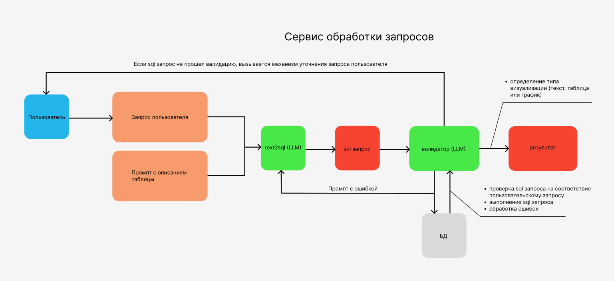

## Дизайн ML системы - \<Сервис обработки запросов пользователя для аналитической платформы\> \<MVP\> \<1.0\>

### 1. Цели и предпосылки 
#### 1.1. Зачем идем в разработку продукта?  

В современных условиях необходимо принимать решения быстро, поэтому возможность оперативного получения информации становится критически важной.
Требуется инструмент, который в режиме онлайн мог бы предоставить наглядный, точный и своевременный ответ на вопросы о показателях, трендах или существующих проблемах на основе данных компании, а также текущих BI-решений. Использование больших языковых моделей может помочь в создании автоматизированных решений подобного вида. 
Любой сотрудник компании, кому необходим доступ к данным/отчетности в компании, может с любого устройства, где можно установить мессенджер или открыть браузер, получить мгновенный ответ.
Персонал для кого важно получать такую информацию:

- Аналитики подразделений
- Директоры департаментов и руководители функций
- Сотрудники дирекции по управлению данными
- Бизнес-аналитики функций
- И др.

Данный инструмент будет применяться в следующих случаях:

1. Когда требуется получить оперативно аналитику, не имея доступ к основному рабочему месту
2. Когда нет времени открывать имеющийся дашборд, но есть понимание того, что именно хочешь получить и по каким фильтрам
3. Когда нет времени на то, чтобы ждать аналитика, который подготовит необходимую информацию и предоставит ее руководителю
4. Когда руководителю не требуется ждать аналитику, а она самостоятельно приходит на телефон в момент, когда показатель отклоняется от нормы или же есть потребность регулярно получать аналитику в начале рабочего дня

Необходимо обеспечить приемлемый уровень качества ответа со стороны чат-бота, чтобы он выдавал ответ ровно на тот вопрос, который задал пользователь. Приемлемый уровень качества ответов >= 80%
Оставшиеся случаи должны управляться ботом в виде доуточняющих подсказок, которые по итогу приведут к корректному выводу информации.

#### 1.2. Постановка задачи  

Разрабатываем сервис обработки запросов с использованием больших языковых моделей

#### 1.3. Бизнес-требования и ограничения  

Требования к сервису обработки запросов

1. Сервис обработки запросов должен понимать запросы пользователя на естественном языке, не требуя специальной формулировки или знания терминологии. Сервис обработки запросов должен уметь обрабатывать следующие операции:

- математические функции: выбор топа, расчет процента,  расчет отклонения, cравнение
- агрегирование данных в одном или нескольких срезах
- фильтровать данные по условию для отбора или исключать данные по условию
- сортировать данные по одному и нескольким полям
- обрабатывать даты и периоды (вчера/позачвчера/номер недель и прочее)

2. Сервис обработки запросов должен уметь замечать орфографические ошибки и транслит и выдавать правильный ответ несмотря на ошибку пользователя 

3. Сервис обработки запросов должен уметь адаптироваться к контексту разговора, учитывая предыдущие запросы и сопутствующую информацию в течение сессии (Например, когда была предоставлена первая выгрузка, а потом пользователь решил уточнить вопрос по уже имеющемуся массиву) 
4. Сервис обработки запросов  должен быть способен к обучению на основе обратной связи, чтобы улучшать релевантность и качество предоставляемой информации на основе опыта пользователей. 
5. Сервис обработки запросов должен обрабатывать следующие уровни запросов:

- Прямые запросы. Например, вывод запрашиваемых данных 
- Запросы, которые требуют обработки и задания уточняющих вопросов
- Запросы, в которых происходит поиск аномалий: ищутся отклонения и делаются выводы почему это произошло (не в mvp)
- Запросы, в которых прогнозируется тренд и даются рекомендации (не в mvp)
6. Если  после получения запроса Сервис обработки запросов понимает, что у него нет данных для ответа, то он должен сообщить об этом пользователю в чате

7. Если  после получения запроса Сервис обработки запросов не имеет достаточно информации для отработки запроса (пользователь не корректно сформировал запрос), то сервис должен отправить в чат уточняющие запросы с вариантами ответов для пользователя. 

8. Сервис обработки запросов при ответе на запросы  должен подбирать способа предоставления результатов - текст, таблица, тип графика 

9. Сервис обработки запросов должен предоставлять персонализированные отчеты и аналитическую информацию в соответствии с настроенными ранее запросами. (не в mvp)

10. Сервис обработки запросов должен отправлять пользователю персональные рекомендации - ссылки на подходящие по запросу дашборды, частые пользовательские запросы, запросы коллег с такими же должностями, дополнительные материалы (не в mvp)

11. Сервис обработки запросов должен иметь функциональность распознавания голоса и перевода его в текст для дальнейшей обработки (не в mvp)

12. Сервис обработки запросов должен проверять уровень доступа к данным пользователя перед отправкой результата и выдавать корректное сообщение если доступа нет

#### 1.4. Что входит в скоуп проекта/итерации, что не входит   

Все в вышеперечисленных пунктах, что не отмечено как (не в mvp) считаем входящим в скоуп первой итерации

#### 1.5. Предпосылки решения  

Для решения задачи используется промпт с описанием базы данных, который включает в себя:
 - название колонки
 - тип данных
 - краткое описание содержимого
 - пример нескольких строк данных
Языковая модель для генерации SQL-запросов на основе текстового описания пользователя
Языковая модель для валидации полученных SQL запросов и обработки ошибок из базы данных  

### 2. Методология   

#### 2.1. Блок-схема решения  
  
