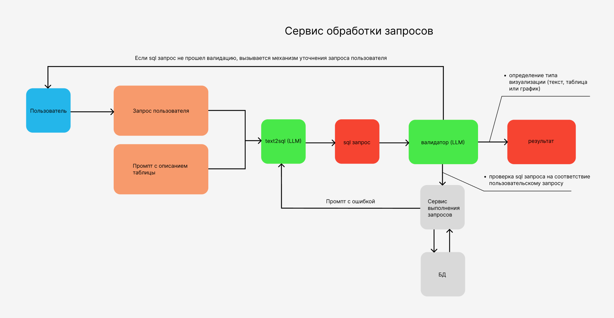
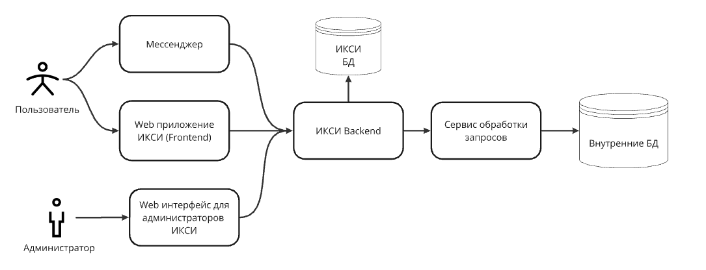

## Дизайн ML системы - \<Сервис обработки запросов пользователя для аналитической платформы\> \<MVP\> \<1.0\>

text2sql analytical service - сервис для аналитической платформы, позволяющей сотрудникам компании получать оперативные данные и аналитику на основе запросов на естественном языке. Сервис использует большие языковые модели для генерации SQL-запросов, обработки ошибок и адаптации к контексту беседы. Он поддерживает широкий набор операций, включая фильтрацию, агрегирование, сортировку данных, а также работу с датами и периодами. Проект ориентирован на предоставление точных и персонализированных ответов, с проверкой прав доступа и подбором формата представления данных.

### 1. Цели и предпосылки 
#### 1.1. Зачем идем в разработку продукта?  

В современных условиях необходимо принимать решения быстро, поэтому возможность оперативного получения информации становится критически важной.
Требуется инструмент, который в режиме онлайн мог бы предоставить наглядный, точный и своевременный ответ на вопросы о показателях, трендах или существующих проблемах на основе данных компании, а также текущих BI-решений. Использование больших языковых моделей может помочь в создании автоматизированных решений подобного вида. 
Любой сотрудник компании, кому необходим доступ к данным/отчетности в компании, может с любого устройства, где можно установить мессенджер или открыть браузер, получить мгновенный ответ.
Персонал для кого важно получать такую информацию:

- Аналитики подразделений
- Директоры департаментов и руководители функций
- Сотрудники дирекции по управлению данными
- Бизнес-аналитики функций
- И др.

Данный инструмент будет применяться в следующих случаях:

1. Когда требуется получить оперативно аналитику, не имея доступ к основному рабочему месту
2. Когда нет времени открывать имеющийся дашборд, но есть понимание того, что именно хочешь получить и по каким фильтрам
3. Когда нет времени на то, чтобы ждать аналитика, который подготовит необходимую информацию и предоставит ее руководителю
4. Когда руководителю не требуется ждать аналитику, а она самостоятельно приходит на телефон в момент, когда показатель отклоняется от нормы или же есть потребность регулярно получать аналитику в начале рабочего дня

Необходимо обеспечить приемлемый уровень качества ответа со стороны чат-бота, чтобы он выдавал ответ ровно на тот вопрос, который задал пользователь. Приемлемый уровень качества ответов >= 80%
Оставшиеся случаи должны управляться ботом в виде доуточняющих подсказок, которые по итогу приведут к корректному выводу информации.

#### 1.2. Постановка задачи  

Разрабатываем сервис обработки запросов с использованием больших языковых моделей. Тип решаемой ML задачи - генерация.

#### 1.3. Бизнес-требования и ограничения  

Требования к сервису обработки запросов

1. Сервис обработки запросов должен понимать запросы пользователя на естественном языке, не требуя специальной формулировки или знания терминологии. Сервис обработки запросов должен уметь обрабатывать следующие операции:

- математические функции: выбор топа, расчет процента,  расчет отклонения, cравнение
- агрегирование данных в одном или нескольких срезах
- фильтровать данные по условию для отбора или исключать данные по условию
- сортировать данные по одному и нескольким полям
- обрабатывать даты и периоды (вчера/позачвчера/номер недель и прочее)

2. Сервис обработки запросов должен уметь замечать орфографические ошибки и транслит и выдавать правильный ответ несмотря на ошибку пользователя 

3. Сервис обработки запросов должен уметь адаптироваться к контексту разговора, учитывая предыдущие запросы и сопутствующую информацию в течение сессии (Например, когда была предоставлена первая выгрузка, а потом пользователь решил уточнить вопрос по уже имеющемуся массиву) (не в mvp)
4. Сервис обработки запросов  должен быть способен к обучению на основе обратной связи, чтобы улучшать релевантность и качество предоставляемой информации на основе опыта пользователей. 
5. Сервис обработки запросов должен обрабатывать следующие уровни запросов:

- Прямые запросы. Например, вывод запрашиваемых данных 
- Запросы, которые требуют обработки и задания уточняющих вопросов
- Запросы, в которых происходит поиск аномалий: ищутся отклонения и делаются выводы почему это произошло (не в mvp)
- Запросы, в которых прогнозируется тренд и даются рекомендации (не в mvp)
6. Если  после получения запроса Сервис обработки запросов понимает, что у него нет данных для ответа, то он должен сообщить об этом пользователю в чате

7. Если  после получения запроса Сервис обработки запросов не имеет достаточно информации для отработки запроса (пользователь не корректно сформировал запрос), то сервис должен отправить в чат уточняющие запросы с вариантами ответов для пользователя. 

8. Сервис обработки запросов при ответе на запросы  должен подбирать способа предоставления результатов - текст, таблица, тип графика 

9. Сервис обработки запросов должен предоставлять персонализированные отчеты и аналитическую информацию в соответствии с настроенными ранее запросами. (не в mvp)

10. Сервис обработки запросов должен отправлять пользователю персональные рекомендации - ссылки на подходящие по запросу дашборды, частые пользовательские запросы, запросы коллег с такими же должностями, дополнительные материалы (не в mvp)

11. Сервис обработки запросов должен иметь функциональность распознавания голоса и перевода его в текст для дальнейшей обработки (не в mvp)

12. Сервис обработки запросов должен проверять уровень доступа к данным пользователя перед отправкой результата и выдавать корректное сообщение если доступа нет

Ограничения

1. Время обработки запросов не должно превышать 20-30 секунд для обеспечения оперативного взаимодействия с пользователем.

2. Сервис должен проверять уровень доступа пользователей к данным перед предоставлением ответа, предотвращая доступ к конфиденциальной или несанкционированной информации.

3. Объем данных, обрабатываемых за один запрос, не должен превышать технические лимиты системы, чтобы избежать задержек и перегрузки.

#### 1.4. Что входит в скоуп проекта/итерации, что не входит   

Все в вышеперечисленных пунктах, что не отмечено как (не в mvp) считаем входящим в скоуп первой итерации

#### 1.5. Предпосылки решения  

Для решения задачи используется промпт с описанием базы данных, который включает в себя:
 - название колонки
 - тип данных
 - краткое описание содержимого
 - пример нескольких строк данных
Языковая модель для генерации SQL-запросов на основе текстового описания пользователя
Языковая модель для валидации полученных SQL запросов и обработки ошибок из базы данных  

### 2. Методология   

#### 2.1. Блок-схема решения  
  

#### 2.2. Этапы решения задачи

**Этап 1 - Получение доступов к витринам данных. Подключение к БД. Сбор и ручная/ автоматизированная разметка датасета для проверки качества работы системы.**

Собирается следующий датасет:
| Вопрос                                      | SQL                                                                                                       | Тип ответа       | Сложность       | Желаемый ответ                                          |
|---------------------------------------------|-----------------------------------------------------------------------------------------------------------|------------------|-----------------|--------------------------------------------------------|
| Средний чек клиентов в Москве за сентябрь 2023 года | SELECT AVG(check_value) AS avg_check FROM db WHERE city = 'Moscow' AND date BETWEEN '2023-09-01' AND '2023-09-30'; | текст            | easy            | В Москве за сентябрь 2023 года средний чек клиентов составил 345.64 руб |
| Определите, сколько клиентов в каждом сегменте использовали более 3 сервисов, и какой средний ARPU у этих клиентов. | SELECT segment_person, COUNT(DISTINCT client_id) AS clients_using_services, AVG(arpu) AS avg_arpu FROM db WHERE cnt_services > 3 GROUP BY segment_person | таблица            | medium            | Таблица с колонками: segment_person, COUNT(DISTINCT client_id), AVG(arpu) |
| Покажите, как менялась сумма продаж по дням в январе 2021 года для магазина с id - store_id_1. | SELECT date AS transaction_date, SUM(turnover) AS total_sales FROM db WHERE date BETWEEN '2021-01-01' AND '2021-01-31' AND store_id='store_id_1' GROUP BY date ORDER BY date | lineplot            | easy            | График lineplot со значениями по осям:  x: transaction_date y: total_sales |
| ...                                         | ...                                                                                                       | ...              | ...             | ...                                                    |

EDA (тут только описание анализа, т.к. оригинальные данные составляют коммерческую тайну компании X5): 
- было собрано и размечено около 100 примеров такого типа
- примеры были разделены по сложности самого sql запроса и того, на сколько сложно перевести запрос с естественного языка на конкретную реализацию sql логики. Оценка сложности проводилась эксперитом-аналитиком, который учитывал следующие критерии: easy - простая выборка данных без JOIN, небольшое количество фильтров в WHERE, без подзапросов; medium - легкие подзапросы, умеренная фильтрация, применение дополнительных агрегаций, оператор having; hard - оконные ф-ии, сложные подзапросы, более 1 таблицы в запросе.
- Тип визуализации был подобран с учетом того, какой наиболее наглядный способ отображения результата выполнения sql кода. Исходя из этого были указаны либо оси для графика, либо точный ответ, который является верным, либо колонки таблицы, которые должны присутствовать в ответе.
- было проверено качество данных, в результате чего отмечено несколько сложностей: аббревиатуры, специфические обозначения аналитических метрик, которые требуют расшифровки с помощью каких формул они рассчитываются, неполное соответствие разметки и sql запроса (не все колонки из ответа упомянуты или не указана гранулярность запроса)
- было проведено улучшение качества данных (переразметка, добавление расшифровок аббревиатур и т.д.)

**Этап 2 - Разработка алгоритма text2sql. Подбор оптимальных моделей, изучение существующих подходов для решения данной задачи. Проведение тестов для проверки работоспособности выбранного решения.**

- Использование внешних моделей (OpenAI, Anthropic, ..) является менее предпочтительным, так как зачастую данные о витринах и содержащейся там информации являются чувствительными для компаний с точки зрения безопасности.
- Поиск open source моделей, специально предобученных на задачу text2sql. Позволяет взять модель с меньшим количеством параметров, но оставляет качество на уровне крупных моделей.
- Использование крупных open source моделей (LLaMA, Mistral, command-r, ..) с использованием техник промптинга.
- Изучение существующих бенчмарков (Spider, Bird, SQL-Eval, ...) для задачи text2sql и способов валидации качества работы пайплайна.
- Тестирование различных подходов и оценка их влияния на качество: 
	- Поиск семантически и структурно похожих запросов из собранной базы данных для создания наиболее оптимального few-shot промпта. 
	- Поиск релевантных запросу колонок с помощью дополнительного агента для составления оптимального промпта схемы бд (уменьшение вероятности допущения ошибки основной моделью из-за большого количества колонок) Дополнительная проверка на наличие лишних столбцов в итоговой схеме.
	- Генерация нескольких кандидатов SQL запроса с помощью разных моделей и выбор наилучшего из них дополнительным агентом. 

Для проверки работоспособности выбранного решения мы будем использовать заранее подготовленные запросы с известными правильными результатами и эталонными SQL-запросами для их получения. Сгенерированные системой запросы будут сравниваться с эталонными. Одной из ключевых метрик станет execution rate, измеряющая долю успешно выполненных запросов.

Поскольку одни и те же результаты могут быть получены разными способами, запрос будет считаться корректным, если ключевая запрашиваемая информация получена. В процессе разработки в качестве прокси-метрик мы будем использовать несколько показателей:
- оценку схожести двух SQL-запросов с помощью LLM-судьи (используется модель gpt-4o)
- замер схожести AST (Abstract Syntax Tree) запросов от 0 до 1
- сопоставление результатов выполнения (на данный момент метрика считается так: если хотя бы один столбец совпадает между df_true и df_pred, то ставим 1, иначе 0) - хорошая корреляция с человеческой валидацией

Таким образом, мы сможем более точно оценить качество работы системы, определить области для улучшения и сравнить показатели между разными моделями для выбора наилучшей.	

**Этап 3 - Разработка сценариев выдачи результатов. Получение в текстовом, табличном или графическом форматах в зависимости от специфики запроса. Настройка соответствующего агента.**

- Создание и тестирование агента, который по заданному запросу и примеру полученного результата будет выдавать оптимальный способ визуализации: текст, таблица или график. Разработка отдельного агента для определения наилучшего типа графика (line, bar, hist, scatter) и агента, определяющего оси для графиков данного вида. Примеры:
- Пользователь запрашивает конкретное число: суммарные продажи. Бот отвечает в чате текстом - "продажи составили N штук"
- Пользователь запрашивает динамику некоторого показателя во времени: продажи по дням в регионе X. Бот выводит график, где по оси x - время по дням, по оси y - продажи.
- Пользователь запрашивает сегмент таблицы - топ 5 городов по продажам. Бот выводит таблицу где 5 строк и 2 колонки - название города, продажи по убыванию.

**Этап 4 - Настройка механизма обработки ошибок при исполнении запросов. Настройка соответствующего агента.**

- Тестирование способностей различных моделей исправлять ошибки в sql запросе и подбор оптимального количества итераций для дебага.
- Добавление различных эвристик постпроцессинга, с помощью которых будут отлавливаться недопустимые или тяжелые запросы (DROP TABLE, SELECT * FROM, ...)

**Этап 5 - Разработка механизма уточнения запроса пользователя. Настройка соответствующего агента.**

- Создание пайплайна уточнений, который позволит пользователям, не знакомым досконально со всей структурой БД или обладающим низким уровнем владения SQL, формулировать достаточно полный запрос для успешного его выполнения.
- Настройка вывода произведенных фильтраций и деталей запроса, для обеспечения возможности пользователю проверить правильность результата. 

**Этап 6 - Создание прототипа веб-приложения. Получение обратной связи от заказчика после тестирования.** 

- Разработка веб интерфейса на Gradio или Streamlit, добавление туда функциональности системы и форму обратной связи. Доработки слабых мест алгоритма.

**Этап 7 - Подготовка финального отчета для бизнеса.** 

### 3. Подготовка пилота

#### 3.1. Способ оценки пилота

Для проведения пилотного тестирования пользователями сервиса будет выполнена оценка результатов. В качетсве пользователей на этом этапе мы берем два типа людей - аналитиков, которые знакомы с хранилищами и могут дать полезный технический фидбек и менеджеры, которые могут оценить, насколько система реально решает их повседневные задачи. Основная метрика - выдает ли наш бот именно ту информацию, которую ожидает увидеть пользователь. Так выглядит пример формы, которую мы будем собирать при пилотировании:

| Вопрос                      | Ответ системы | Сгенерированный код                                                      | Комментарий пользователя                         | Правильный ответ | Дата нахождения проблемы | Статус (на доработке/uat/готово) | Дата решения проблемы | Оценка сложности SQL запроса |
| --------------------------- | ------------- | ------------------------------------------------------------------------ | ------------------------------------------------ | ---------------- | ------------------------ | -------------------------------- | --------------------- | ---------------------------- |
| Количество клиентских чеков | X             | SELECT COUNT(DISTINCT t.client_id) AS total_clients   FROM table AS t | в данном запросе считает клиентов, но не их чеки | Y                | 02.12.2024               | на доработке                     | 30.12.2024            | easy                         |

#### 3.2. Бейзлайн

В качестве бейзлайна берем модель [llama-3-sqlcoder-8b](https://huggingface.co/defog/llama-3-sqlcoder-8b). Модель специально дообучена на text2sql задачах, довольно маленькая и уже развернута в контуре.
Помимо бейзлайна тестируем другие модели для того, чтобы оценить, какое качество может быть получено на наших данных и что можно было бы использовать как дальнейшее развитие.

Маленький валидационный сет (20 семплов)

| Модель                  | AST score | LLM score | DF score | mean score |
| ----------------------- | --------- | --------- | -------- | ---------- |
| sqlcoder-8b             | 0.39      | 0.11      | 0.26     | 0.25       |
| qwen2.5-coder-32b       | 0.26      | 0.16      | 0.53     | 0.32       |
| qwen2.5-72b-instuct     | 0.33      | 0.32      | 0.53     | 0.39       |
| llama-3.1-405b-instruct | 0.27      | 0.21      | 0.37     | 0.28       |
| Deepseek V3             | 0.37      | 0.3       | 0.47     | 0.38       |
| gpt-4o                  | 0.35      | 0.32      | 0.53     | 0.4        |

Получаем, что в качестве замены sql-coder можно рассмотреть qwen2.5-72b-instuct как доступное opensource решение. Делаем дополнительные эксперименты:

Большой валидационный сет (85 семплов)

| Модель              | AST score | LLM score | DF score | mean score | Error rate |
| ------------------- | --------- | --------- | -------- | ---------- | ---------- |
| sqlcoder-8b         | 0.21      | 0.07      | 0.2      | 0.16       | 0.16       |
| qwen2.5-72b-instuct | 0.37      | 0.19      | 0.36     | 0.31       | 0.14       |

#### 3.3. Что считаем успешным пилотом

Успешным пилот будет считаться, в случае, если на уровне запросов easy и medium, система будет показывать результаты на уровне 40-50% execution rate. Этот показатель должен быть рассчитан как на основе наших бенчмарков, так и по результатам формы обратной связи от пользователей.

#### 3.4. Подготовка пилота

На этапе пилота будем использовать существующую в компании инфраструктуру и локальные модели на собственных серверных решениях rtx/dgx.

### 4. Внедрение

#### 4.1. Архитектура решения

ИКСИ - внутреннее название проекта.

Веб приложение будет состоять и frontend и backend частей, пользователь взаимодействует с системой либо через мессенджер, либо через web интерфейс. Backend будет иметь собственную бд для хранения информации из пользовательских чатов. Также будет отдельная админ панель.

Сервис обработки запросов будет взаимодействовать с внутренними аналитическими бд для получения информации о структуре таблиц и полей. Внутри сервиса будет реализована логика контроля доступа к данным.

#### 4.2. Описание инфраструктуры и масштабируемости

Сервис обработки запросов должен быть способен масштабироваться по мере роста объема данных и пользователей без негативного влияния на качество и скорость работы. Должен быть реализован механизм логирования всех пользовательских действий, запросов, результатов выдачи ответов от пользователей для последующего анализа и контроля обработанных запросов. Необходимо разработать сервис сбора обратной связи от пользователей после получения ответа на запрос.

Икси должен быть интегрирован:
- с мессенджерами, обеспечивая удобный доступ для пользователей в любое время
- иметь интерфейс чата, который может встраиваться любой web интерфейс
- с системой контроля доступа для обеспечения конфиденциальности и безопасности данных (учитывающей разделение на разные уровни доступа к данным - по территории, категориям товаров, функциям, доступа к персональным данным)
- с существующей инфраструктурой управления данными и системами аналитики

#### 4.3. Требования к работе системы

| **Параметр сервиса**                                                               | **Уровень сервиса**                                                                                                                                                          |
| ---------------------------------------------------------------------------------- | ---------------------------------------------------------------------------------------------------------------------------------------------------------------------------- |
| Критичность сервиса                                                                | Не критичный                                                                                                                                                                 |
| График использования предмета автоматизации                                        | 24х7                                                                                                                                                                         |
| График работы поддержки пользователей                                              | 8*5 с 9:00 по МСК                                                                                                                                                            |
| Время реакции (отработка обращений, классификация, назначение на группу поддержки) | 30 мин                                                                                                                                                                       |
| Время решения обращений по приоритетам                                             | высокий - 12р.ч.                                                                                                                                                             |
| География пользователей (использования)                                            | Вся география присутствия торговой сети "Пятерочка"                                                                                                                          |
| Количество драйверов сервиса                                                       | Время отклика на отчет не должно превышать 25 секунд при больших моделях, для остальных не более 10 секунд. ~3000 уникальных пользователей ежемесячно и ~ 100 единовременно |

#### 4.4. Безопасность системы

Сервис обработки запросов должен выявлять атаки (контролировать целенаправленную нагрузку сервис). Для этого в системе будут введены ограничения на количество отправляемых запросов в единицу времени. Также будет контролироваться вычислительная сложность запросов с целью предотвращения неограниченно долгого исполнения.

#### 4.5. Безопасность данных

Сервис обработки запросов должен проверять уровень доступа к данным пользователя перед отправкой результата. Сервис обработки запросов должен обеспечивать безопасное обращение с конфиденциальной информацией и соблюдение стандартов безопасности данных при обмене информацией.